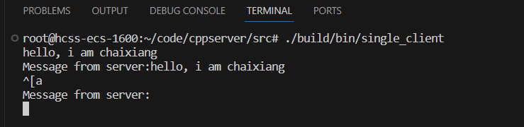
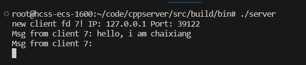
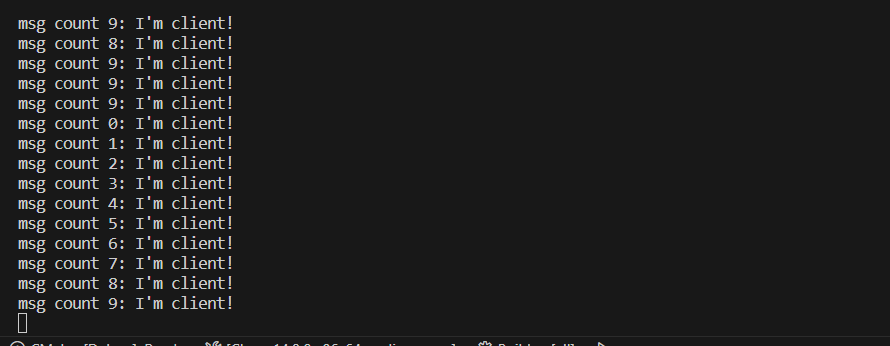
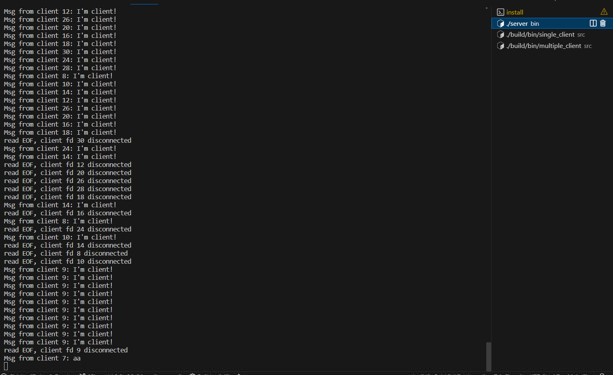

### 项目介绍：

一个以事件驱动面向 Linux 的 C/C++服务器，采用主从 Reactor 多线程模式,基于 epoll 的高并发服务器实现。

- day00 socket确认链接
- day01 client阻塞发送，单方面c->s
- day02 client非阻塞发送  ，c->s,s->c
- day03 epoll s可以连接更多的 c
- day04 封装channel，每个fd有每个chanel实现自己要做的事
- day05 Eventloop,eloop有epoll，负责更新chan和 todo_chananl的事，server提供2种事，新连接、回复 


##### 主要工作：

1. 封装 epoll，从请求驱动变为事件驱动。
2. 抽象出了 EventLoop 和 Channel，实现任何程序复用
3. 加入线程池，把接受新连接和事件池处理分离实现主从 Reactor 多线程。
4. 对网络库进行并发测试，测量实现一万并发。


##### 环境依赖：

clang

cmake

### 构建并运行：

1. 构建CMake

   ```bash
   mkdir build
   cd build
   cmake ..
   ```
2. 编译 server 、single_client、multiple_client

   ```bash
   make
   make server
   make single_client
   make multiple_client
   ```
3. 运行server 、single_client、multiple_client

   ```
   cd bin
   ./server		#启动一个服务器
   ./single_client		#启动一个客户端
   ./multiple_client-t 10000 -m 10 	#启动多并发测试（10000个客户端，每个客户端发10次信息就结束）
   ```

##### 结果:

客户端：发送成功，并接受到服务器的回显



服务器端：检测到一个新的客户端连接并分配为socket的id为7，接受到7号客户的消息。并返回响应




##### 高并发测试

```bash
./multiple_client-t 10000 -m 10 
```

客户端：发送成功



服务器端：成功处理请求，没有崩溃


